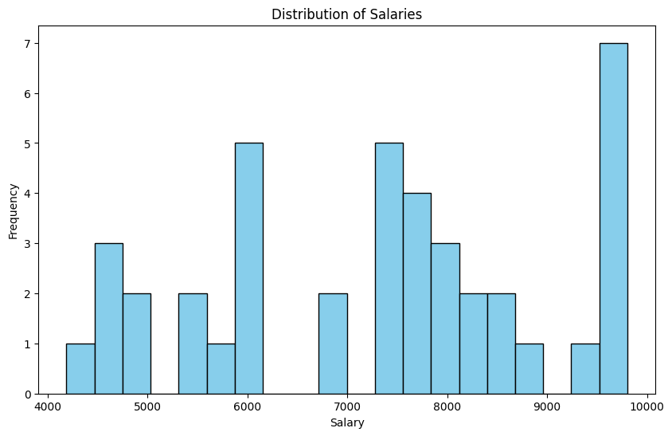
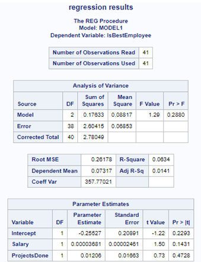

# Software Packages project

This is a project for the Software Packages course that analyzes the activity and the expansion possibilities of a made-up organization with Pyton and SAS using a data set that was generated.

## Example code

### Exercise 1

**Task:**  
Create a set of unique project titles from the *projects* dataset. Using a loop, print out each unique project title and the count of employees working on each project.

```Python
unique_projects = set(projects['Title'])

for title in unique_projects:
    count = merged_df[merged_df['Title'] == title].shape[0]
    print('Project Title:', title, ', Count of Employees:', count)
```

**Output:**  

```
Project Title: Tax Strategy Count of Employees: 6
Project Title: Financial Planning Count of Employees: 2
Project Title: Data Analytics Count of Employees: 6
Project Title: Operational Improvement Count of Employees: 12
Project Title: Technology Implementation Count of Employees: 6
Project Title: Internal Audit Count of Employees: 4
Project Title: Market Analysis Count of Employees: 5
```

### Exercise 2

**Task:**  
Using the *merged* employees dataset and the count of employees per project from the last exercise, create a histogram of salaries and a bar chart showing the number of employees per project. Customize the plots with titles, labels, and legends.

```Python
plt.figure(figsize=(10, 6))
plt.hist(merged_df['Salary'], bins=20, color='skyblue', edgecolor='black')
plt.title('Distribution of Salaries')
plt.xlabel('Salary')
plt.ylabel('Frequency')

plt.figure(figsize=(15, 7))
pd.DataFrame(count_employees, index=list(unique_projects)).plot(kind='bar', color='lightgreen', edgecolor='black', legend=False)
plt.title('Number of Employees by Project')
plt.xlabel('Project Title')
plt.ylabel('Number of Employees')
plt.xticks(rotation=75)
plt.show()
```

**Output:**  


### Exercise 3

**Task:**  
Conduct a multiple regression analysis to understand the impact of salary and the number of projects done on the likelihood of an employee being rated as a 'BestEmployee' in their department. Create a binary variable for 'BestEmployee' status based on the 'BestEmployeeID' in the departments dataset.

```Python
employees_1 = employees.reset_index()
employees_1['IsBestEmployee'] = employees_1['EmployeeID'].apply(lambda x: 1 if x in departments['BestEmployeeID'].values else 0)
```

```SAS
proc reg data=ad_data.employees_1;
model IsBestEmployee=Salary ProjectsDone;
title 'regression results';
run;
```

**Output:**  


## Project requirements

The project will use Python and SAS program packages in order to analyze the activity and the expansion possibilities of an organization.

### SAS functionalities

- [x] ~~creating a SAS data set from external files;~~
- [x] ~~creating and using user-defined formats;~~
- [x] ~~iterative and conditional processing of data;~~
- [x] ~~creating data subsets;~~
- [x] ~~using SAS functions;~~
- [x] ~~combining data sets with specific SAS and SQL procedures;~~
- [x] ~~using report procedures;~~
- [x] ~~using statistical procedures;~~
- [x] ~~generating graphs.~~

### Python functionalities

- [x] ~~using lists and dictionaries, including their specific methods;~~
- [x] ~~using sets and tuples, including their specific methods;~~
- [x] ~~defining and calling some functions;~~
- [x] ~~using conditional structures;~~
- [x] ~~using repetitive structures;~~
- [x] ~~importing a csv or json file into the pandas package;~~
- [x] ~~accessing data with loc and iloc;~~
- [x] ~~modifying data in the pandas package;~~
- [x] ~~using group functions;~~
- [x] ~~dealing with missing values;~~
- [x] ~~deleting columns and records;~~
- [x] ~~statistical processing, grouping and aggregation of data in the pandas package;~~
- [x] ~~processing of data sets with merge / join;~~
- [x] ~~graphical representation of the data with the matplotlib package;~~
- [x] ~~using scikit-learn package (clustering, logistic regression);~~
- [x] ~~using statmodels package (multiple regression).~~
